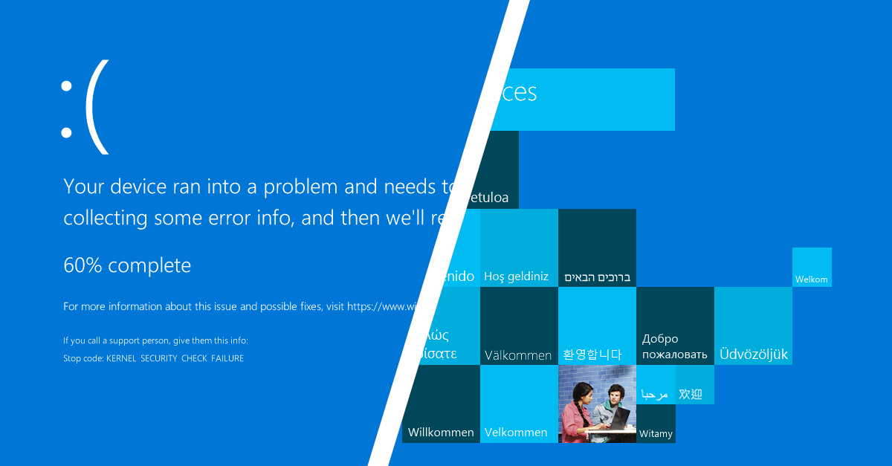

# CVE-2022-21907 - Double Free in http.sys driver

<p align="center">
   
   <a href="https://twitter.com/intent/follow?screen_name=podalirius_" title="Follow"></a>
   <br>
   <br>
</p>



## Summary

An unauthenticated attacker can send an HTTP request with an "`Accept-Encoding`" HTTP request header triggering a double free in the unknown coding-list inside the HTTP Protocol Stack (`http.sys`) to process packets, resulting in a kernel crash.

### Vulnerable systems

 - **Windows Server 2019 and Windows 10 version 1809**:
    + :x: Not vulnerable by default. Unless you have set the HTTP Trailer Support to `EnableTrailerSupport` in `HKEY_LOCAL_MACHINE\System\CurrentControlSet\Services\HTTP\Parameters\`, the systems are not vulnerable.
 - **Windows 10 version 2004 (build `19041.450`)**:
    + ✔️ Vulnerable

You can find the `http.sys` driver of Windows 10 version 2004 (build `19041.450`) here:

| Patch status | Driver      |
|--------------|-------------|
| Before patch | [./ressources/drivers_before_update/C/Windows/System32/drivers/http.sys](ressources/drivers_before_update/C/Windows/System32/drivers/http.sys) |
| After patch  | [./ressources/drivers_after_update/C/Windows/System32/drivers/http.sys](ressources/drivers_after_update/C/Windows/System32/drivers/http.sys) |

## Demonstration

https://user-images.githubusercontent.com/79218792/149931289-57615b83-8208-4afc-bcc0-a4155b1db8aa.mp4

## Usage

```
$ ./CVE-2022-21907_http.sys_crash.py -h
usage: CVE-2022-21907_http.sys_crash.py [-h] -t TARGET [-v]

Description message

optional arguments:
  -h, --help            show this help message and exit
  -t TARGET, --target TARGET
                        Target IIS Server.
  -v, --verbose         Verbose mode. (default: False)
```
