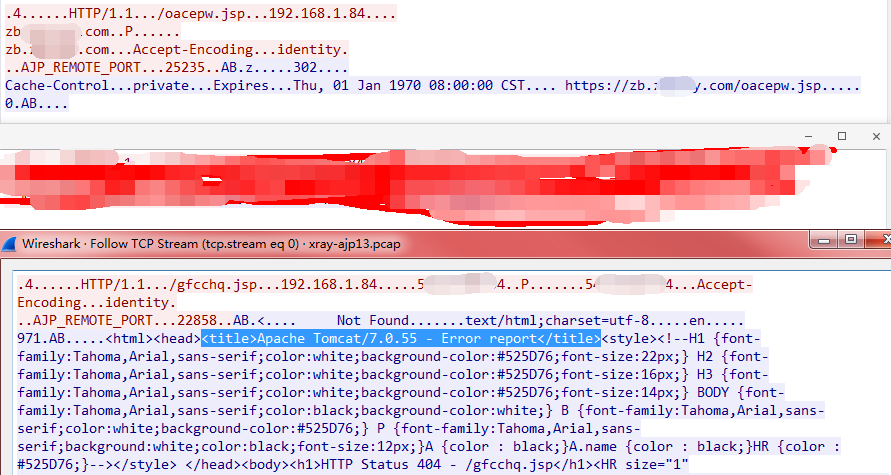
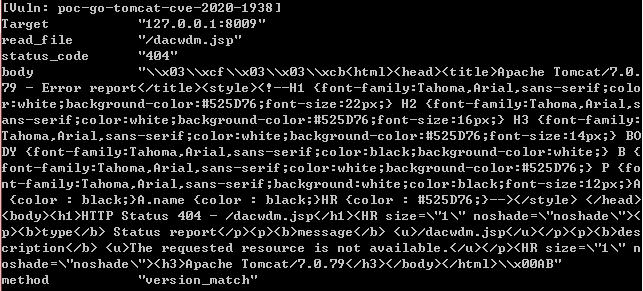
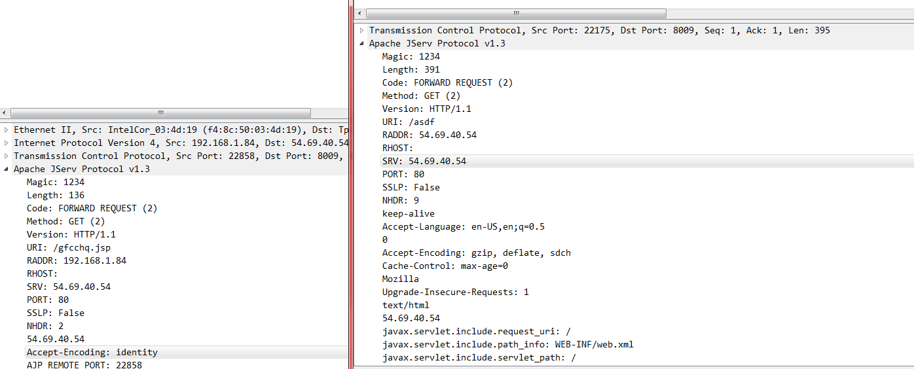

## 背景

Tomcat 是当前最流行的 Java 中间件服务器之一

Ghostcat（幽灵猫） 是由长亭科技安全研究员发现的存在于 Tomcat 中的安全漏洞，由于 Tomcat AJP 协议设计上存在缺陷，攻击者通过 Tomcat AJP Connector 可以读取或包含 Tomcat 上所有 webapp 目录下的不限于class、xml、jar的任意文件。例如可以读取 webapp 配置文件或源代码。此外在目标应用有文件上传功能的情况下(可以上传一个图片马或任意后缀名文件)，配合文件包含的利用还可以达到远程代码执行的危害。

## 利用

1、利用DefaultServlet实现任意文件读取

当url请求未在映射的url列表里面则会通过tomcat默认的DefaultServlet会根据上面的三个属性来读取文件

	javax.servlet.include.request_uri
	javax.servlet.include.path_info
	javax.servlet.include.servlet_path

因为这三个属性可控，可以通过控制ajp控制的上述三个属性来读取文件。

2、通过jspservlet实现任意后缀文件包含

当url (比如 http://xxx/xxx/xxx.jsp) 请求映射在org.apache.jasper.servlet.JspServlet这个servlet的时候也可通过上述三个属性来控制访问的jsp文件

当ajp URI设置为jsp路径时，Tomcat会调用JspServlet的service方法处理，以jsp解析该文件 所以只需要一个可控文件内容的文件即可实现rce

所以构造一个 .jsp 的路径，访问执行上传的图片。

命令执行的一句话：

	<%out.println(new java.io.BufferedReader(new java.io.InputStreamReader(Runtime.getRuntime().exec("whoami").getInputStream())).readLine());%>

保存在附件： poc.jpg

## 数据包分析

xray两种检测方式 (上面是should403【就是 tomcat 修复之后，这个请求应该 403，但是这里没有 403】,下面是version_match)

xray-detection1-should403:

xray-detection2-version_match:

xray(下左)发包字节少于网上的poc(下右)

## 解决方案

1、临时禁用AJP协议端口，在conf/server.xml配置文件中注释掉<Connector port="8009" protocol="AJP/1.3"redirectPort="8443" />

2、配置ajp配置中的secretRequired跟secret属性来限制认证

3、官方下载最新版下载地址：

https://tomcat.apache.org/download-70.cgi

https://tomcat.apache.org/download-80.cgi

https://tomcat.apache.org/download-90.cgi

或Github下载：https://github.com/apache/tomcat/releases

## 参考资料

[Apache Tomcat 曝出 Ghostcat 高危文件读取/包含漏洞](https://mp.weixin.qq.com/s/D1hiKJpah3NhEBLwtTodsg)

[ajp协议规范](https://tomcat.apache.org/connectors-doc/ajp/ajpv13a.html)

